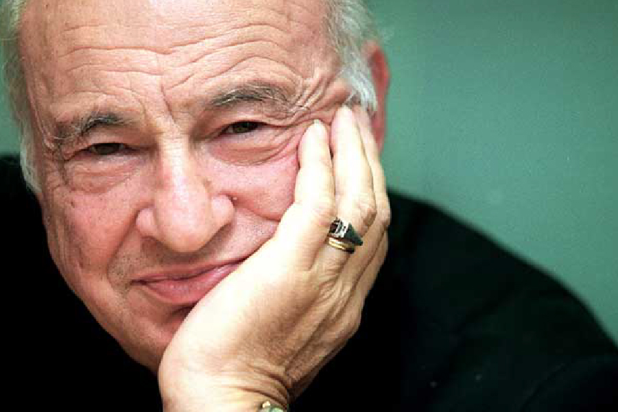

Realizei diversas atualizações no código do site, aprimorando tanto o aspecto visual quanto a funcionalidade da navegação. O principal objetivo do site é apresentar de forma clara e atrativa um panorama sobre a vida, a obra e o pensamento do filósofo e sociólogo Edgar Morin.

Deixarei o código abaixo do HTML e CSS:

HTML:

<!DOCTYPE html>
<html lang="pt-BR">
<head>
    <meta charset="UTF-8">
    <meta name="viewport" content="width=device-width, initial-scale=1.0">
    <meta name="description" content="Conheça a vida e obra de Edgar Morin, o renomado sociólogo e filósofo francês">
    <link rel="stylesheet" href="https://cdnjs.cloudflare.com/ajax/libs/font-awesome/6.4.0/css/all.min.css">
    <link rel="stylesheet" type="text/css" href="style.css">
    <title>Edgar Morin | Sociólogo e Filósofo Contemporâneo</title>
</head>
<body>
    <header class="hero">
        

            <h1 class="titulo-principal">Edgar Morin</h1>
            
Sociólogo, filósofo e pensador da complexidade

        

    </header>

    <main class="container">

        <section class="img-destaque">
            <figure>
                
                <figcaption>
                    <i class="fas fa-quote-left"></i> Edgar Morin: Sociólogo e filósofo francês da complexidade <i class="fas fa-quote-right"></i>
                </figcaption>
            </figure>
        </section>

        <section class="biografia-container card">
            <h2><i class="fas fa-book-open"></i> Biografia</h2>
            

                Edgar Morin nasceu em Paris, no dia 8 de julho de 1921. É um antropólogo, sociólogo e filósofo francês, judeu de origem sefardita. 
                Pesquisador emérito do Centre National de la Recherche Scientifique. Formado em Direito, História e Geografia, realizou estudos em filosofia, sociologia e epistemologia. 
            

            

                É autor de mais de trinta livros, entre eles: <em>O método</em> (6 volumes), <em>Introdução ao pensamento complexo</em>, <em>Ciência com consciência</em> e <em>Os sete saberes necessários para a educação do futuro</em>. 
                Durante a Segunda Guerra Mundial, participou da Resistência Francesa. É considerado um dos principais pensadores contemporâneos e um dos principais teóricos da complexidade.
            

            

                Filho único, seu pai, Vidal Nahoum, era um comerciante originário de Salônica. Sua mãe, Luna Beressi, faleceu quando ele tinha 10 anos. Ateu declarado, descreve-se como um neomarrano.
            

        </section>

        <section class="frase-container card">
            <blockquote>
                <i class="fas fa-quote-left"></i> É preciso ser guiado ao mesmo tempo pela razão e pela paixão, e isso é navegar pela vida <i class="fas fa-quote-right"></i>
            </blockquote>
            
— Edgar Morin

        </section>

        <section class="curiosidades card">
            <h2><i class="fas fa-lightbulb"></i> Curiosidades</h2>
            

                

                    <h3><i class="fas fa-id-card"></i> Nome verdadeiro</h3>
                    
Edgar Morin nasceu como Edgar Nahoum, em 8 de julho de 1921, em Paris. Ele adotou o sobrenome "Morin" durante a Segunda Guerra Mundial, quando se juntou à Resistência Francesa.

                

                

                    <h3><i class="fas fa-fist-raised"></i> Resistência Francesa</h3>
                    
Durante a ocupação nazista da França, Morin entrou para a Resistência Francesa e se engajou em atividades contra o regime colaboracionista de Vichy.

                

                

                    <h3><i class="fas fa-globe-americas"></i> Cidadão do mundo</h3>
                    
Ele recebeu diversos títulos honorários em universidades ao redor do mundo e influenciou políticas educacionais e sociais em vários países.

                

                

                    <h3><i class="fas fa-graduation-cap"></i> Educação</h3>
                    
Morin propôs uma reforma educacional baseada no pensamento complexo, defendendo que a educação deve preparar os alunos para enfrentar a incerteza e os desafios globais.

                

            

        </section>

   
        <section class="livros-container card">
            <h2><i class="fas fa-book"></i> Obras Principais</h2>
            

                

                    
                    <h3>Introdução ao Pensamento Complexo</h3>
                    <a href="https://www.amazon.com.br/Introdu%C3%A7%C3%A3o-Pensamento-Complexo-Edgar-Morin/dp/8520505988" class="btn" target="_blank">Comprar</a>
                

                

                    
                    <h3>Os Sete Saberes</h3>
                    <a href="https://www.amazon.com.br/Os-sete-saberes-necess%C3%A1rios-educa%C3%A7%C3%A3o/dp/852830203X" class="btn" target="_blank">Comprar</a>
                

                

                    
                    <h3>Ciência com Consciência</h3>
                    <a href="https://www.amazon.com.br/Ci%C3%AAncia-com-Consci%C3%AAncia-Edgar-Morin/dp/8576571568" class="btn" target="_blank">Comprar</a>
                

            

        </section>
    </main>

    <footer class="footer">
        
© 2025 Página sobre Edgar Morin

        
Criado para fins educacionais

</body>
</html>

CSS:

:root {
    --primary-color: #2c3e50;
    --secondary-color: #34495e;
    --accent-color: #e74c3c;
    --light-color: #ecf0f1;
    --dark-color: #2c3e50;
    --text-color: #333;
    --text-light: #7f8c8d;
}

* {
    margin: 0;
    padding: 0;
    box-sizing: border-box;
}

body {
    font-family: 'Segoe UI', Tahoma, Geneva, Verdana, sans-serif;
    line-height: 1.6;
    color: var(--text-color);
    background-color: #f5f7fa;
}

.hero {
    background: linear-gradient(135deg, var(--primary-color), var(--secondary-color));
    color: white;
    padding: 4rem 2rem;
    text-align: center;
    margin-bottom: 2rem;
}

.hero-content {
    max-width: 800px;
    margin: 0 auto;
}

.titulo-principal {
    font-size: 3rem;
    margin-bottom: 1rem;
    font-weight: 700;
}

.paragrafo-principal {
    font-size: 1.5rem;
    opacity: 0.9;
}

.container {
    max-width: 1200px;
    margin: 0 auto;
    padding: 0 20px;
}

.card {
    background: white;
    border-radius: 10px;
    box-shadow: 0 5px 15px rgba(0, 0, 0, 0.1);
    padding: 2rem;
    margin-bottom: 2rem;
}

.img-destaque {
    margin-bottom: 2rem;
}

.img-destaque img {
    max-width: 100%;
    height: auto;
    border-radius: 8px;
    box-shadow: 0 5px 15px rgba(0, 0, 0, 0.2);
}

.img-destaque figcaption {
    margin-top: 1rem;
    font-style: italic;
    color: var(--text-light);
    font-size: 1.1rem;
}

.biografia-container h2,
.curiosidades h2,
.livros-container h2 {
    color: var(--primary-color);
    margin-bottom: 1.5rem;
    font-size: 2rem;
    display: flex;
    align-items: center;
    gap: 10px;
}

.biografia-container p {
    margin-bottom: 1rem;
    font-size: 1.1rem;
}

.frase-container {
    background: linear-gradient(135deg, var(--primary-color), var(--secondary-color));
    color: white;
    padding: 3rem;
    border-radius: 10px;
    text-align: center;
    margin: 2rem 0;
}

.frase-container blockquote {
    font-size: 1.8rem;
    font-weight: 300;
    line-height: 1.4;
    margin-bottom: 1rem;
}

.autor {
    font-size: 1.2rem;
    font-style: italic;
}

.curiosidades-grid {
    display: grid;
    grid-template-columns: repeat(auto-fit, minmax(250px, 1fr));
    gap: 2rem;
}

.curiosidade-item {
    background: var(--light-color);
    padding: 1.5rem;
    border-radius: 8px;
    transition: transform 0.3s ease;
}

.curiosidade-item:hover {
    transform: translateY(-5px);
}

.curiosidade-item h3 {
    color: var(--accent-color);
    margin-bottom: 1rem;
    display: flex;
    align-items: center;
    gap: 10px;
}

.livros-container h2 {
    text-align: center;
}

.livros-grid {
    display: grid;
    grid-template-columns: repeat(auto-fit, minmax(250px, 1fr));
    gap: 2rem;
    margin-top: 2rem;
}

.livro-item {
    text-align: center;
    background: var(--light-color);
    padding: 1.5rem;
    border-radius: 8px;
    transition: transform 0.3s ease;
}

.livro-item:hover {
    transform: translateY(-5px);
}

.livro-item img {
    max-width: 100%;
    height: auto;
    border-radius: 5px;
    margin-bottom: 1rem;
    box-shadow: 0 3px 10px rgba(0, 0, 0, 0.2);
}

.btn {
    display: inline-block;
    background: var(--accent-color);
    color: white;
    padding: 0.7rem 1.5rem;
    border-radius: 5px;
    text-decoration: none;
    font-weight: bold;
    transition: background 0.3s ease;
    margin-top: 1rem;
}

.btn:hover {
    background: #c0392b;
}

.footer {
    background: var(--dark-color);
    color: white;
    text-align: center;
    padding: 2rem;
    margin-top: 3rem;
}

.social-icons {
    margin-top: 1rem;
    display: flex;
    justify-content: center;
    gap: 1rem;
}

.social-icons a {
    color: white;
    font-size: 1.5rem;
    transition: color 0.3s ease;
}

.social-icons a:hover {
    color: var(--accent-color);
}

@media (max-width: 768px) {
    .titulo-principal {
        font-size: 2.2rem;
    }
    
    .paragrafo-principal {
        font-size: 1.2rem;
    }
    
    .frase-container blockquote {
        font-size: 1.4rem;
    }
}

@media (max-width: 480px) {
    .hero {
        padding: 3rem 1rem;
    }
    
    .titulo-principal {
        font-size: 1.8rem;
    }
    
    .card {
        padding: 1.5rem;
    }
}

